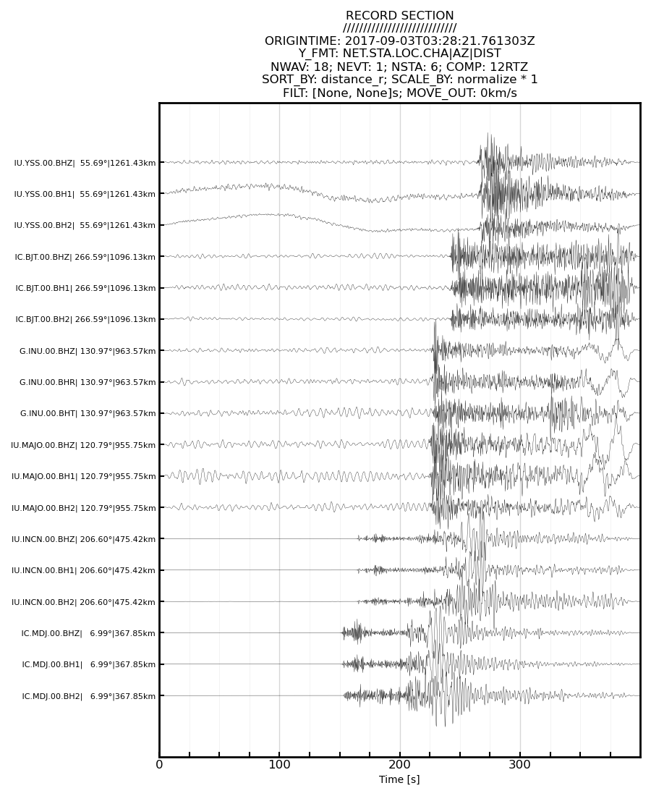
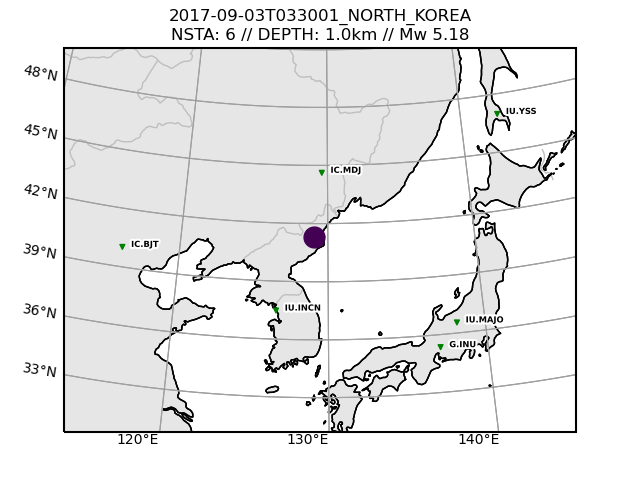

Python Seismogram Extraction and Processing
===========================================

`PySEP` uses ObsPy tools to request seismic data and metadata, process, 
standardize and format the data, and write out SAC files with the underlying 
motivation of preparing data for moment tensor inversions, although the 
written files can be used for other purposes.

The main processing steps taken by `PySEP` are:

1. Create or gather event metadata (QuakeML) with user-defined event parameters 
2. Gather station metdata (StationXML) in a bounding box surrounding an event, 
3. Curtail station list due to distance or azimuth constraints
4. Gather three-component waveform data for chosen station catalog
5. Quality check waveforms: remove gaps, null out missing components, address 
  clipped amplitudes
6. Preprocess waveforms: detrend, remove response, amplitude scaling, 
  standardizing time series.
7. Rotate streams to desired components: ZNE, RTZ, UVW (triaxial orthogonal)
8. Append SAC headers with event and station metadata, and TauP arrivals
9. Write per-component SAC files, and StationXML, QuakeML and MSEED files
10. Write CAP (Cut-and-Paste) weight files for moment tensor inversions
11. Write config YAML files which can be used to re-run data gathering/processing
12. Plot a record section and source-receiver map

PySEP also has the capacity to:

* Interface with a Lawrence Livermore National Laboratory database of nuclear
  explosion and earthquake waveforms (see note)
* Allow access to embargoed waveform data and PASSCAL HDF5 (PH5) datasets
* Access pre-defined configuration files for data used in previous studies 
* Input custom TauP models for arrival time estimation

### Installation

We recommend installing PySEP into a Conda environment. Dependencies are 
installed via Conda where possible, with Pip used to install PySEP itself. 
This will set two command line tools `pysep` and `recsec`
```bash
$ conda create -n pysep python=3.10
$ conda activate pysep
$ git clone https://github.com/uafgeotools/pysep.git
$ cd pysep
$ conda install --file requirements.txt
$ pip install -e .
```

### Running Tests

PySEP comes with unit testing which should be run before and after making any
changes to see if your changes have altered the expected code behavior.
```bash
$ cd tests
$ pytest
```

### Gallery

An example record section produced by the `recsec` tool inside PySEP



An example station map generated from collected metadata during a PySEP run



--------------------------------------------------------------------------------

## Command Line Usage

Normal users should use PySEP as a command line tool. 

To bring up the command line tool help message:

```bash
$ pysep -h 
```

To list out available pre-defined configuration files

```bash
$ pysep -l  # or pysep --list
-p/--preset -e/--event
-p MTUQ2022_workshop -e 2009-04-07T201255_ANCHORAGE.yaml
-p MTUQ2022_workshop -e 2014-08-25T161903_ICELAND.yaml
-p MTUQ2022_workshop -e 2017-09-03T033001_NORTH_KOREA.yaml
-p MTUQ2022_workshop -e 2020-04-04T015318_SOUTHERN_CALIFORNIA.yaml
```

To run one of the pre-defined configuration files

``` bash
$ pysep -p MTUQ2022_workshop -e 2017-09-03T033001_NORTH_KOREA.yaml 
```

To create a template configuration file that you must fill out with your own
parameters

```bash
$ pysep -W  # or pysep --write
```

To run this newly created configuration file

```bash
$ pysep -c pysep_config.yaml
```


--------------------------------------------------------------------------------

### Record Section plotter

PySEP also comes with a pretty sophisticated record section tool, which plots
seismic data acquired by PySEP. When you have successfully collected your data,
it will reside in the /SAC folder of the PySEP output directory. 


To see available record section plotting commands

```bash
$ recsec -h  # RECordSECtion
```

To plot the waveform data in a record section with default parameters

```bash
$ recsec --pysep_path ./SAC
```

To plot a record section with a 7km/s move out, high-pass filtered at 1s

```bash
$ recsec --pysep_path ./SAC --move_out 7 --min_period_s 1
```

To sort your record section by azimuth and not distance (default sorting)

```bash
$ recsec --pysep_path ./SAC --sort_by azimuth
```

Have a look at the -h/--help message and the docstring at the top of `recsec.py`
for more options.


--------------------------------------------------------------------------------

## Scripting Usage

More advanced users can use PySEP as a scripting tool rather than a command 
line tool. 

All of the gathered data/metadata are saved as attributes of the Pysep class 
with typical ObsPy naming schema

```python
>>> from pysep import Pysep
>>> sep = Pysep(config_file='pysep_config.yaml')
>>> sep.run()
>>> print(sep.st[0].stats.sac)
>>> sep.inv
>>> sep.event
```

If you already have data but want to benefit from the processing and quality
assurance/formatting capabilities of PySEP, you can provide your own ObsPy
objects

```python
>>> from pysep import Pysep
>>> from obspy import read, read_events, read_inventory
>>> st = read()
>>> inv = read_inventory()
>>> event = read_events()[0]
>>> sep = Pysep(st=st, inv=inv, event=event, config_file="config.yaml")
```

Although not the preferred method of interacting with PySEP, you can forgo the 
config file and pass parameters directly to the instantiation of the PySEP 
class, making PySEP a bit more flexible.

```python
>>> from pysep import Pysep
>>> sep = Pysep(origin_time="2000-01-01T00:00:00", event_latitude=43.254,
                event_longitude=156.443, event_depth_km=15., ....
                )
```

To append SAC headers to your own seismic data, you can directly use the
`PySEP` utility functions

```python
>>> from pysep.utils.cap_sac import append_sac_headers, format_sac_header_w_taup_traveltimes
>>> from obspy import read, read_events, read_inventory
>>> st = read()
>>> inv = read_inventory()
>>> event = read_events()[0]
>>> st = append_sac_headers(st=st, inv=inv, event=event)
>>> st = format_sac_header_w_taup_traveltimes(st=st, model="ak135")
```

Check out the Pysep.run() function for other API options for using PySEP.

--------------------------------------------------------------------------------

### LLNL Note

`PySEP` interfaces with the databases of:

* W. Walter et al. (2006)
  An assembled western United States dataset for regional seismic analysis
  ISSO 9660 CD, LLNL release UCRL-MI-222502
  
  Download link: https://ds.iris.edu/mda/18-001

