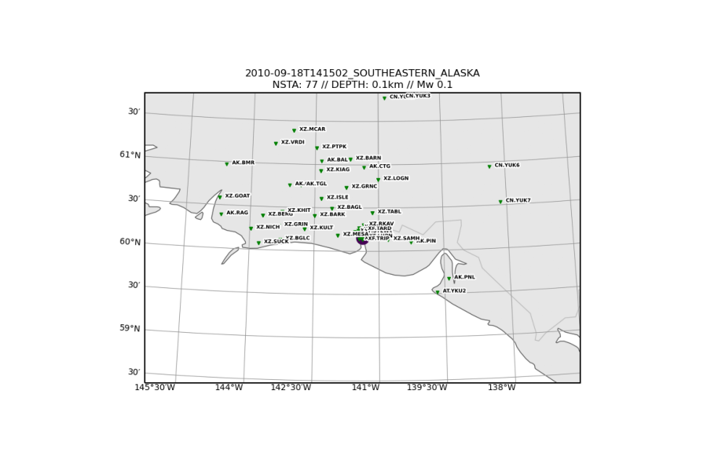
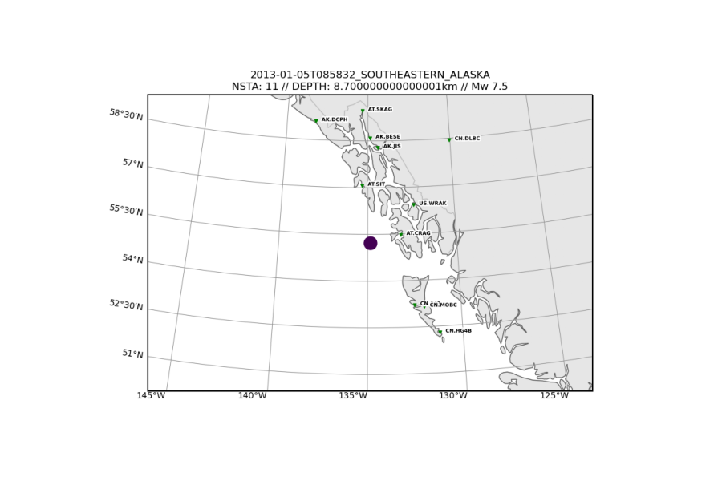
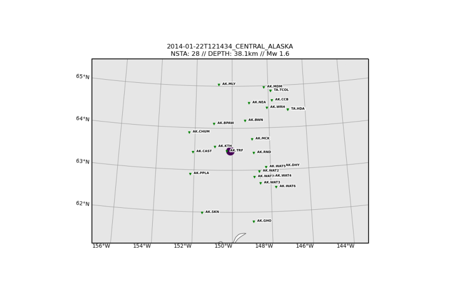
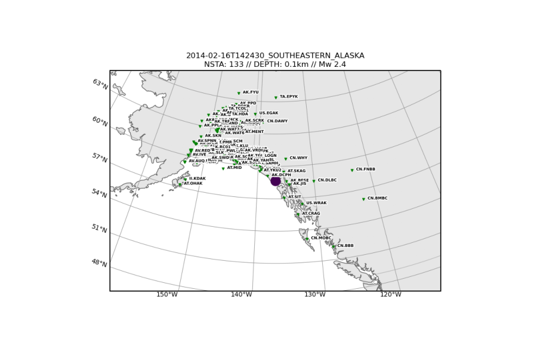
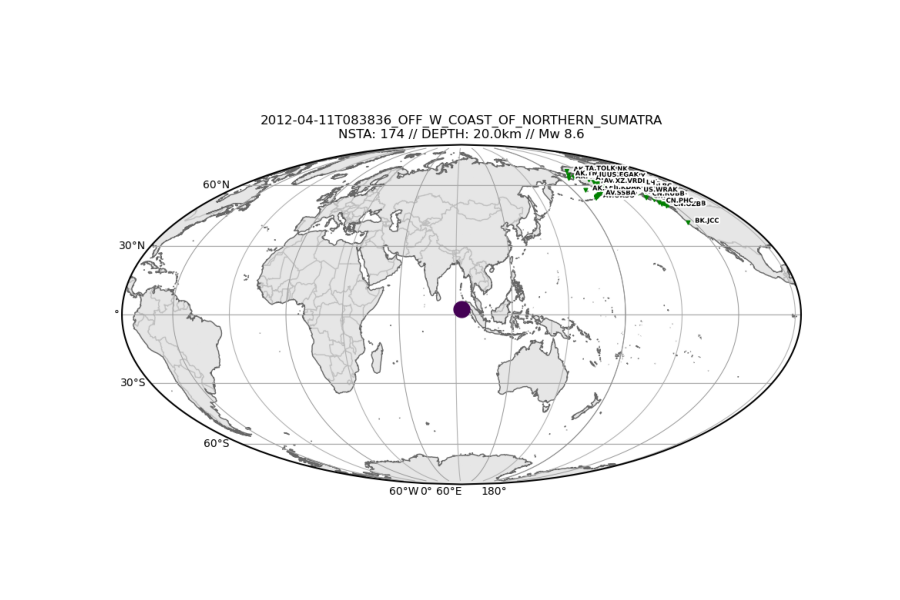

Lab: Analyzing Seismic Data in Record Sections
----------------------------------------------

The following lab exercises were created by Aakash Gupta and Carl Tape as a part 
of the *Applied Seismology* (GEOS 626/426) course at 
University of Alaska Fairbanks. The Jupyter Notebook for this class assignment 
can be found on 
`GitHub <https://github.com/uafgeoteach/GEOS626_seis/blob/main/lab_record_section.ipynb>`__

.. note::

    This lab has been reformatted with respect to the course notebook for
    optimized readability on `ReadTheDocs`, but the material is otherwise
    the same as what is presented in the course.

Instructions
~~~~~~~~~~~~

-  The goal is to create different seismic record section plots. A
   seismic record section is a series of seismograms that is plotted in
   some particular order. Typically, the x-axis is time, and then the
   seismograms are separated in the y-direction and ordered by
   source-station distance or source-station azimuth.
-  There are two main procedures of this lab:

   -  fetching waveforms from the IRIS Data Management Center.
   -  plotting record sections of seismograms.

-  The two main procedures are executed using the software package
   `PySEP <https://pysep.readthedocs.io/en/devel/index.html>`__, which
   uses `ObsPy <https://docs.obspy.org/>`__. Check PySEP’s `data
   gathering <https://pysep.readthedocs.io/en/devel/autoapi/pysep/pysep/index.html#pysep.pysep.Pysep>`__
   and `record section
   plot <https://pysep.readthedocs.io/en/devel/autoapi/pysep/recsec/index.html#pysep.recsec.RecordSection>`__
   pages for details on the two procedures.
-  The bandpass filter that is applied to the seismograms can have a
   dramatic effect on what is visible. The frequency limits of the
   bandpass is one of several important choices that are needed when
   plotting record sections. Check the IRIS
   `webpage <https://ds.iris.edu/ds/nodes/dmc/data/formats/seed-channel-naming>`__
   for the SEED format seismic channel naming.
-  We will not be removing instrument responses, as we did in
   lab_response. However, removing the instrument response can easily be
   achieved with the same tools. The two reasons we do not remove the
   responses are:

   -  it takes a bit longer, computationally.
   -  it can significantly distort the shape of the unfiltered
      waveforms, especially ones that are “odd,” which, here, we are
      interested in.


Table of Contents
`````````````````

-  The notebook is organized into 7 event examples -

   -  

      1. Yahtse glacier calving event

   -  

      2. Mw 7.5 earthquake in southeastern Alaska

   -  

      3. explosion in Fairbanks

   -  

      4. very low frequency (VLF) event near Kantishna

   -  

      5. landslide near Lituya Bay

   -  

      6. Mw 8.6 Indian Ocean (offshore Sumatra) recorded in Alaska, plus
         triggered earthquakes

      -  6.1. triggered earthquake (Andreanof)
      -  6.2. triggered earthquake (Nenana crustal)
      -  6.3. triggered earthquake (Iliamna intraslab)

   -  

      7. your own example

-  Spend some time to understand the two key parts of each example - -
   waveform extraction - plotting a record section

Notebook Preamble
``````````````````

   **NOTE:** The notebook is designed such that data for a given example
   is downloaded only once and stored for subsequent use.

.. code:: ipython3
    
    import matplotlib.pyplot as plt
    import matplotlib.image as img
    import numpy as np
    import os
    import warnings
    
    from copy import copy
    from obspy.core import UTCDateTime
    from pysep import Pysep
    from pysep.recsec import plotw_rs

.. code:: ipython3

    # script settings
    
    warnings.filterwarnings("ignore")
    plt.rcParams['figure.figsize'] = 9, 6
..

.. code:: ipython3

    def fetch_and_plot(event, duration, download, plotting, bandpass):
    
        '''
        - downloads seismograms and plot them in a record section based on user inputs
        - also plots a source station map corresponding to the downloaded data
        - uses PySEP's data download and record section plotting utilities for the same
        - does not download data if the output data directory already exists
        '''
    
        '''
        :type event: dict
        :param event: event details
        :type duration: dict
        :param duration: time range for for data requested
        :type download: dict
        :param download: data download parameters
        :type plotting: dict
        :param plotting: record section plotting parameters
        :type bandpass: dict
        :param bandpass: bandpass filter parameters
        '''
    
        # download data
        data_dir  = f'{download["output_dir"]}/{download["overwrite_event_tag"]}'
        overwrite = f'{download["overwrite"]}'
    
        if (not os.path.isdir(data_dir)) or (overwrite == 'True'):
            print('\npreparing to download data ....')
            ps = Pysep(**event,**duration,**download)
            ps.run()
        else:
            print('\ndata directory already exists, no data will be downloaded')
    
    
        # plot source station map
        print('plotting source station map ....')
        plt.figure()
        source_station_map = img.imread(f'{data_dir}/station_map.png')
        plt.imshow(source_station_map)
        plt.show()
    
        # plot the record section using Pyseps's record section plotting tool
        print('\nplotting record section ....')
        plotw_rs(**plotting, **bandpass)

.. code:: ipython3

    # setting pysep's data download defaults
    
    # list of networks to retrieve data from
    # providing an explicit list of networks is safer than using the wildcard (*)
    networks            = ('AK,AT,AU,AV,BK,CI,CN,CU,GT,IC,II,IM,IU,MS,TA,TS,US,'
                           'XE,XM,XR,YM,YV,XF,XP,XZ')
    # \networks            = '*'
    
    download_defaults   = dict( networks                     = networks,
                                stations                     = '*',
                                locations                    = '*',
                                channels                     = 'BHZ',
                                maxdistance_km               = 200,
                                remove_clipped               = False,
                                remove_insufficient_length   = False,
                                fill_data_gaps               = 0,
                                remove_response              = False,
                                log_level                    = 'INFO',
                                plot_files                   = 'map',
                                output_dir                   = 'datawf',
                                sac_subdir                   = '',
                                overwrite_event_tag          = f'',
                                overwrite                    = False )

.. code:: ipython3

    # setting pysep's record section plotting defaults
    
    plotting_defaults   = dict( pysep_path                   = '',
                                wildcard                     = '*.sac',
                                sort_by                      = 'distance',
                                scale_by                     = 'normalize',
                                amplitude_scale_factor       = 1,
                                time_shift_s                 = None,
                                preprocess                   = 'st',
                                max_traces_per_rs            = None,
                                distance_units               = 'km',
                                tmarks                       = [0],
                                save                         = '',
                                log_level                    = 'CRITICAL' )

Example 1: Yahtse glacier calving event
~~~~~~~~~~~~~~~~~~~~~~~~~~~~~~~~~~~~~~~

**Exercise**

-  *Examine and then run the code cell below.*
-  *From the station map generated, examine the source–station geometry,
   especially closest to the epicenter.*
-  *In the record section generated, how are the seismograms ordered and
   aligned?*
-  *What does NET.STA.LOC.CHA|AZ|DIST represent?*
-  *What do HHZ and BHZ channels represent?*
-  *What input variables were needed to specify the bandpass?*
-  *How is a bandpass filter applied within plotw_rs()? Hint: find the
   online documentation.*
-  *Describe the characteristics of this signal. Do you see a distinct P
   wave on any seismogram? (This will be clearer later, after you have
   seen P waves from normal earthquakes.)*
-  *Describe some oddities within the record section.*

.. code:: ipython3

    # 1. Yahtse Glacier event
    # event information could not be found on catalog
    
    download   = copy(download_defaults)
    plotting   = copy(plotting_defaults)
    
    event      = dict( origin_time                  = UTCDateTime("2010,9,18,14,15,2"),
                       event_latitude               = 60.155496,
                       event_longitude              = -141.378343,
                       event_depth_km               = 0.1,
                       event_magnitude              = 0.1 )
    
    duration   = dict( seconds_before_ref           = 20,
                       seconds_after_ref            = 70 )
    
    download['channels']                            = 'HHZ,BHZ'
    download['overwrite_event_tag']                 = 'Example_1'
    
    bandpass   = dict( min_period_s                 = 0.1,
                       max_period_s                 = 2 )
    
    plotting["pysep_path"]                          = f'{download["output_dir"]}/{download["overwrite_event_tag"]}'
    
    fetch_and_plot(event,duration,download,plotting,bandpass)





-  *Now try out the different options for sorting seismograms in record
   sections by running the next cell.*
-  *You can add* \_r\* to reverse the sorting order; for example, for
   *alphabetical_r* the sorting will go from Z to A.\*

.. code:: ipython3

    # seismogram sorting options
    # set to run only for example_index = 1
    
    sort_by_tag = ['distance', 'absolute distance', 'azimuth', 'absolute azimuth']
    
    for i, sort_by in enumerate(['distance', 'abs_distance', 'azimuth', 'abs_azimuth']):
    
        print(f'\n\nCase {i+1}: Seismograms sorted by {sort_by_tag[i]}\n\n')
    
        plotting['sort_by']  = sort_by
    
        plotw_rs(**plotting, **bandpass)

    
**Case 1: Seismograms sorted by distance**

.. image:: lab_record_section_files/lab_record_section_3.png


**Case 2: Seismograms sorted by absolute distance**


    
**Case 3: Seismograms sorted by azimuth**
    


    
**Case 4: Seismograms sorted by absolute azimuth**


**Seismograms aligned on the S wave arrival**

-  *Now try aligning the seismograms on an arrival of your choice.*
-  *The example below aligns the seismograms on the estimated S arrival
   times.*

.. code:: ipython3

    # seismograms alignment on the S wave
    # set to run only for example_index = 1
    
    print(f'\n\nSeismograms aligned on the S wave arrival\n\n')
    
    plotting['sort_by']      = 'distance'
    plotting['time_shift_s'] = 's_arrival_time'
    
    plotw_rs(**plotting, **bandpass)


Example 2: Mw 7.5 earthquake in southeastern Alaska, near-source recordings
~~~~~~~~~~~~~~~~~~~~~~~~~~~~~~~~~~~~~~~~~~~~~~~~~~~~~~~~~~~~~~~~~~~~~~~~~~~

**Event information**:  

https://earthquake.usgs.gov/earthquakes/eventpage/ak0138esnzr

**Exercise**

-  *Examine and then run the code cell below.*
-  *Comment on the notable features of the seismograms.*

.. code:: ipython3

    # 2. Mw 7.5 earthquake in southeastern Alaska
    
    download   = copy(download_defaults)
    plotting   = copy(plotting_defaults)
    
    channels_1 = 'BHZ,BHE,BHN,BH1,BH2'                                           # broadband channels
    channels_2 = 'BNZ,BNE,BNN,BN1,BN2,BLZ,BLE,BLN,BL1,BL2'                       # strong motion channels
    channels_3 = 'HNZ,HNE,HNN,HN1,HN2,HLZ,HLE,HLN,HL1,HL2'                       # strong motion channels
    
    # warning: waveforms will have different units (nm/s, nm/s^2)
    channels   = f'{channels_1},{channels_2},{channels_3}'
    
    event      = dict( origin_time                  = UTCDateTime("2013,1,5,8,58,32"),
                       event_latitude               = 55.228,
                       event_longitude              = -134.859,
                       event_depth_km               = 8.7,
                       event_magnitude              = 7.5 )
    
    duration   = dict( seconds_before_ref           = 50,
                       seconds_after_ref            = 300 )
    
    download['channels']                            = channels
    download['maxdistance_km']                      = 500
    download['overwrite_event_tag']                 = 'Example_2'
    
    bandpass   = dict( min_period_s                 = None,
                       max_period_s                 = None )
    
    plotting['amplitude_scale_factor']              = 0.5
    plotting['max_traces_per_rs']                   = 13
    plotting["pysep_path"]                          = f'{download["output_dir"]}/{download["overwrite_event_tag"]}'
    
    fetch_and_plot(event,duration,download,plotting,bandpass)





.. image:: lab_record_section_files/lab_record_section_9.png


Example 3: Explosion in Fairbanks
~~~~~~~~~~~~~~~~~~~~~~~~~~~~~~~~~

**Exercise**

-  *Examine and then run the code cell below.*
-  *There are two signals that appear at most stations. Start by
   examining the station MDM (Murphy Dome).*
-  *There is only one source, so how can you explain both signals in
   terms of their travel times and amplitudes?*

.. code:: ipython3

    # 3. explosion in Fairbanks
    # event information could not be found on catalog
    
    download   = copy(download_defaults)
    plotting   = copy(plotting_defaults)
    
    #event location based on infrasound
    #elat = 64.8156; elon = -147.9419                                            # original AEC
    #elat = 64.8045; elon = -147.9653                                            # reviewed AEC
    
    event      = dict( origin_time                  = UTCDateTime("2013,2,3,1,10,31"),
                       event_latitude               = 64.80175,
                       event_longitude              = -147.98236,
                       event_depth_km               = 0.1,
                       event_magnitude              = 0.1 )
    
    duration   = dict( seconds_before_ref           = 50,
                       seconds_after_ref            = 200 / 0.3 )                # air wave travel time
    
    download['channels']                            = 'SHZ,HHZ,BHZ'              # broadband channels
    download['overwrite_event_tag']                 = 'Example_3'
    
    bandpass   = dict( min_period_s                 = 0.2,
                       max_period_s                 = 1 )
    
    plotting["pysep_path"]                          = f'{download["output_dir"]}/{download["overwrite_event_tag"]}'
    
    fetch_and_plot(event,duration,download,plotting,bandpass)


Example 4: Very low frequency earthquake near Denali
~~~~~~~~~~~~~~~~~~~~~~~~~~~~~~~~~~~~~~~~~~~~~~~~~~~~

**Exercise**

-  *Examine and then run the code cell below.*
-  *Estimate the dominant frequency of this event?*

.. code:: ipython3

    # 4. very low frequency (VLF) event near Kantishna
    # event information taken from IRIS
    
    download   = copy(download_defaults)
    plotting   = copy(plotting_defaults)
    
    event      = dict( origin_time                  = UTCDateTime("2014,1,22,12,14,34"),
                       event_latitude               = 63.46,
                       event_longitude              = -150.11,
                       event_depth_km               = 38.1,
                       event_magnitude              = 1.6 )
    
    duration   = dict( seconds_before_ref           = 0,
                       seconds_after_ref            = 100 )
    
    download['overwrite_event_tag']                 = 'Example_4'
    
    bandpass   = dict( min_period_s                 = None,
                       max_period_s                 = 2 )
    
    plotting["pysep_path"]                          = f'{download["output_dir"]}/{download["overwrite_event_tag"]}'
    
    fetch_and_plot(event,duration,download,plotting,bandpass)





Example 5: Landslide near Lituya Bay
~~~~~~~~~~~~~~~~~~~~~~~~~~~~~~~~~~~~

**Exercise**

-  *Examine and then run the code cell below.*
-  *What is the dominant frequency of this event?*

.. code:: ipython3

    # 5. landslide near Lituya Bay
    # event information taken from IRIS
    
    download   = copy(download_defaults)
    plotting   = copy(plotting_defaults)
    
    event      = dict( origin_time                  = UTCDateTime("2014,2,16,14,24,30"),
                       event_latitude               = 58.67,
                       event_longitude              = -136.84,
                       event_depth_km               = 0.1,
                       event_magnitude              = 2.4 )
    
    duration   = dict( seconds_before_ref           = 0,
                       seconds_after_ref            = 600 )
    
    download['maxdistance_km']                      = 1000
    download['overwrite_event_tag']                 = 'Example_5'
    
    bandpass   = dict( min_period_s                 = 10,
                       max_period_s                 = 40 )
    
    plotting["pysep_path"]                          = f'{download["output_dir"]}/{download["overwrite_event_tag"]}'
    
    fetch_and_plot(event,duration,download,plotting,bandpass)





Example 6: Mw 8.6 Indian Ocean (offshore Sumatra) earthquake triggering earthquakes in Alaska
~~~~~~~~~~~~~~~~~~~~~~~~~~~~~~~~~~~~~~~~~~~~~~~~~~~~~~~~~~~~~~~~~~~~~~~~~~~~~~~~~~~~~~~~~~~~~~~~~

**Event information** 

- 6. Indian Ocean: https://earthquake.usgs.gov/earthquakes/eventpage/official20120411083836720_20  
- 6.1. Andreanof: https://earthquake.usgs.gov/earthquakes/eventpage/usp000jhh4  
- 6.2. Nenana: https://earthquake.usgs.gov/earthquakes/eventpage/ak024ouaxa8   
- 6.3. Iliamna: https://earthquake.usgs.gov/earthquakes/eventpage/ak0124ouezxl  

.. code:: ipython3

    # origin times of known earthquakes
    origin_time_sumatra   = UTCDateTime("2012,4,11,8,38,36")
    origin_time_andreanof = UTCDateTime("2012,4,11,9,0,9")
    origin_time_nenana    = UTCDateTime("2012,4,11,9,21,57")
    origin_time_iliamna   = UTCDateTime("2012,4,11,9,40,58")
    
    # origin times, in seconds, relative to Sumatra origin time
    t_andreanof = origin_time_andreanof - origin_time_sumatra
    t_nenana    = origin_time_nenana    - origin_time_sumatra
    t_iliamna   = origin_time_iliamna   - origin_time_sumatra


**Exercise**

-  *Examine and then run the code cell below.*
-  *Examine the record section and try to determine what you see*.
-  *For each event (which we define as a signal that appears on several
   stations), determine what the closest station is. Where did each
   event occur?*
-  *Change the bandpass period range (min_period_s and max_period_s) for
   the record section plot to be 2–1000s, so that you see the complete
   frequency range of this waveform.*
-  *Approximately how long did this earthquake last in Alaska?*

.. code:: ipython3

    # 6. Mw 8.6 Indian Ocean (offshore Sumatra) earthquake
    
    download   = copy(download_defaults)
    plotting   = copy(plotting_defaults)
    
    event      = dict( origin_time                  = origin_time_sumatra,
                       event_latitude               = 2.327,
                       event_longitude              = 93.063,
                       event_depth_km               = 20,
                       event_magnitude              = 8.6 )
    
    duration   = dict( seconds_before_ref           = 0.25 * 60 * 60,
                       seconds_after_ref            = 2    * 60 * 60 )
    
    stations   = dict( minlatitude                  =    64.922 - 25,
                       maxlatitude                  =    64.922 + 25,
                       minlongitude                 = - 148.946 - 25,
                       maxlongitude                 = - 148.946 + 25 )
    
    download['maxdistance_km']                      = 6371 * np.pi
    download                                        = {**download, **stations}
    download['overwrite_event_tag']                 = 'Example_6'
    
    # P wave + triggered events
    bandpass   = dict( min_period_s                 = 0.25,
                       max_period_s                 = 0.5 )
    
    # full wavetrain (no triggered events visible)
    # bandpass   = dict( min_period_s                 = 2,
    #                    max_period_s                 = 1000 )
    
    plotting['distance_units']                      = 'deg'
    plotting['tmarks']                              = [0, t_andreanof, t_nenana, t_iliamna]
    plotting["pysep_path"]                          = f'{download["output_dir"]}/{download["overwrite_event_tag"]}'
    
    fetch_and_plot(event,duration,download,plotting,bandpass)





**Exercise**

-  *Examine and then run the code cells for example 6.1., 6.2. and 6.3.
   below.*
-  *You are given the source parameters for three earthquakes that
   occurred in Alaska during the ground motion of the main wavetrain
   from the Mw 8.6 Indian Ocean (offshore Sumatra) earthquake. For each
   possibly triggered event, tabulate the following information:*   

   - the closest station (and the distance in km)  
   - the suspicious stations   
   - the widest period range over which the signal is clearly visible. 
     This can be achieved by varying min_period_s and max_period_s provided as 
     an input for plotting the record sections.  

.. code:: ipython3

    # 6.1. triggered earthquake - Andreanof (NEIC)
    
    download   = copy(download_defaults)
    plotting   = copy(plotting_defaults)
    
    event      = dict( origin_time                  = origin_time_andreanof,
                       event_latitude               = 51.364,
                       event_longitude              = -176.097,
                       event_depth_km               = 20.8,
                       event_magnitude              = 5.5 )
    
    duration   = dict( seconds_before_ref           = 10,
                       seconds_after_ref            = 600 )
    
    download['maxdistance_km']                      = 2000
    download['overwrite_event_tag']                 = 'Example_6.1'
    
    bandpass   = dict( min_period_s                 = 0.25,
                       max_period_s                 = 0.5 )
    
    plotting["pysep_path"]                          = f'{download["output_dir"]}/{download["overwrite_event_tag"]}'
    
    fetch_and_plot(event,duration,download,plotting,bandpass)


.. code:: ipython3

    # 6.2. triggered earthquake - Nenana crustal (NEIC)
    
    download   = copy(download_defaults)
    plotting   = copy(plotting_defaults)
    
    event      = dict( origin_time                  = origin_time_nenana,
                       event_latitude               = 64.922,
                       event_longitude              = -148.946,
                       event_depth_km               = 19.3,
                       event_magnitude              = 3.9 )
    
    duration   = dict( seconds_before_ref           = 10,
                       seconds_after_ref            = 200 )
    
    download['overwrite_event_tag']                 = 'Example_6.2'
    
    bandpass   = dict( min_period_s                 = 0.25,
                       max_period_s                 = 0.5 )
    
    plotting["pysep_path"]                          = f'{download["output_dir"]}/{download["overwrite_event_tag"]}'
    
    fetch_and_plot(event,duration,download,plotting,bandpass)


.. code:: ipython3

    # 6.3. triggered earthquake - Iliamna intraslab (NEIC)
    
    download   = copy(download_defaults)
    plotting   = copy(plotting_defaults)
    
    event      = dict( origin_time                  = origin_time_iliamna,
                       event_latitude               = 60.104,
                       event_longitude              = -152.832,
                       event_depth_km               = 101.5,
                       event_magnitude              = 2.9 )
    
    duration   = dict( seconds_before_ref           = 10,
                       seconds_after_ref            = 200 )
    
    download['maxdistance_km']                      = 400
    download['overwrite_event_tag']                 = 'Example_6.3'
    
    bandpass   = dict( min_period_s                 = 0.25,
                       max_period_s                 = 0.5 )
    
    plotting["pysep_path"]                          = f'{download["output_dir"]}/{download["overwrite_event_tag"]}'
    
    fetch_and_plot(event,duration,download,plotting,bandpass)


Example 7: Your own example
~~~~~~~~~~~~~~~~~~~~~~~~~~~

**Exercise**

-  *Examine and then modify the code cell below to look at an event of
   your interest, by extracting waveforms and plotting a record
   section.*

.. code:: ipython3

    # 7. your own example below
    
    download   = copy(download_defaults)
    plotting   = copy(plotting_defaults)
    
    download['overwrite_event_tag'] = 'Example_7'
    plotting["pysep_path"] = f'{download["output_dir"]}/{download["overwrite_event_tag"]}'
    
    event      = dict()
    
    duration   = dict()
    
    bandpass   = dict()
    
    # fetch_and_plot(event,duration,download,plotting,bandpass)
    
    

